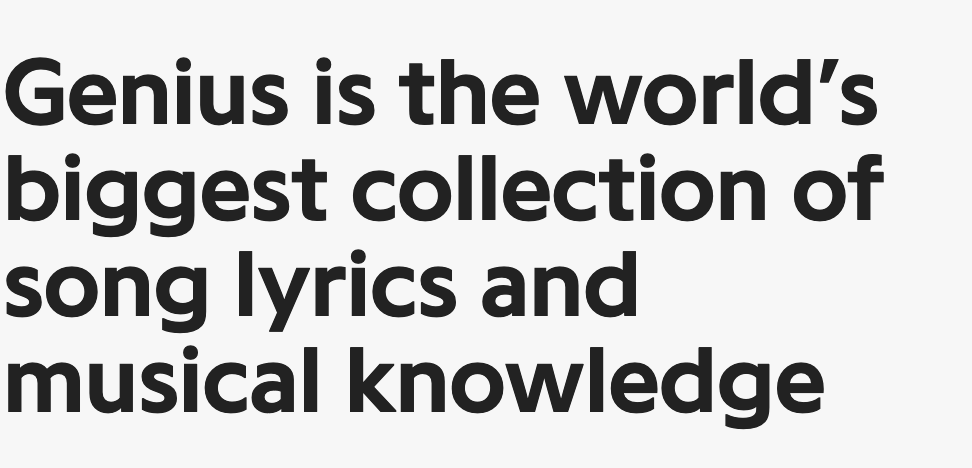

# cs224n-final-project-data
# Introduction
## Background
### Motivation 
As a rhetoric student, I wanted to further explore how neural networks could pick up on the more subtle semantic patterns in natural language. However, one of the main challenges in NLP is a lack of labeled data, especially in regard to something like [pragmatics](https://en.wikipedia.org/wiki/Pragmatics) (the study of meaning, with respect to goals and intentions). 

Luckily, I remembered a website that I had used in an experimental high school English class. My teacher frequently utilized [Genius.com](https://genius.com/) for close reading assignments in our class, where he would post exerpts from Shakespeare or The Great Gatsby, and students would "annotate" selections from the passages by highlighting them and explaining their literary functions. Here's [an example of one of my annotations](https://genius.com/1078024) from way back in high school, if you're interested!

I always loved close reading, and thought it was a great way to develop a deeper understanding of a text. Could I develop an algorithm that could close read, like we do? 

Genius.com wasn't initially intended to be a site for English class close reading. It was even called "Rap Genius" at the time because it was meant to be a community where users could read and contribute these annotations to explain rap lyrics. 

### What is Genius?
[Genius](https://genius.com/) is an online community where users browse, rate, and create annotations for lyrics to help explain their meaning and context.

  

The primary goal of Genius is to explain lyrics and help make them more accessible to listeners. Generally, these are explanations regarding the semantic and/or cultural meanings behind lyrics, which can often cryptic and filled with linguistic subtleties that we wouldn't normally expect a computer to be able to pick up on.

  

This is effectively a dataset of labeled meaning, if we can assume that these crowdsourced annotations tend to truly "explain" the meaning behind their respective lyrics. Just like any real-world dataset, this assumption might be a stretch, since plenty of these annotations go off on unrelated tangents or focus on cultural context that isn't generalizable.

Although this dataset is far from ideal, it still might be useful in training a model that can explain user-input lyrics. So let's give it a try!
